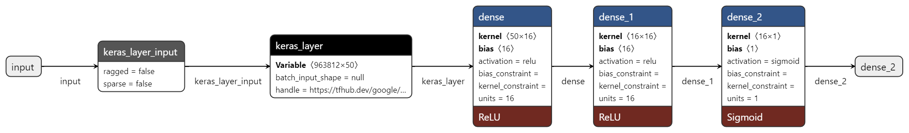

# Twitter-sentiment-classification

## Table of contents
* [General info](#general-info)
* [Development](#development)
* [Technologies](#technologies)
* [Setup](#setup)

## General info
Twitter sentiment analysis using machine learning and natural language processing is a process of extracting information from twitter data and turning it into meaningful insights. This can be used to understand how people feel about a particular topic, product, or brand.

Twitter data is unstructured and contains a lot of noise. This makes it difficult to analyze using traditional methods. Machine learning and natural language processing can be used to overcome these challenges.

Machine learning algorithms can be used to automatically classify tweets as positive, negative, or neutral. Natural language processing can be used to extract features from the tweets such as the sentiment of the words used.

This information can be used to understand how people feel about a particular topic. It can also be used to track the sentiment of a brand over time.

## Development 
### Developing the model
We start by creating our machine learning model. The model is built using a pre-trained sentence embeddings based on feed-forward Neural-Net Language Models with pre-built OOV and trained on Google News 7B corpus (7 billion words). Then we add two dense layers of 16 neurons each and an output layer with one neuron and sigmoid activation function. The model takes a batch of sentences in a 1-D tensor of strings as input and encodes each one as a single 50-dimensional vector, then it computes the probability of a positive sentiment. 
 
We will use sentiment140 dataset with 1.6 million tweets to train our model on sentiments classification. Visit this [kaggle](https://www.kaggle.com/datasets/kazanova/sentiment140?sort=votes) link for more details..
You can find the pre-trained sentence embeddings layer handle link on Tensorflow hub [here](https://tfhub.dev/google/nnlm-en-dim50/2).
### Developing the application
#### Twitter app
To start using twitter api with Tweepy library, we need to setup our Twitter API authentication credentials first. https://developer.twitter.com/en/docs/twitter-api/getting-started/getting-access-to-the-twitter-api
#### Streamlit app
To setup a front end for our project and display the results made by the model predictions we developed a Streamlit app. Streamlit is an open source app framework in Python language. It helps us create web apps for data science and machine learning in a short time.

## Technologies
The project is created with:
* Python: 3.10.8
* Tensorflow: 2.9.1
* Pandas: 1.4.4
* Keras: 2.9.0
* Tweepy: 4.12.1
* Streamlit: 1.14.1
* Numpy: 1.21.5

      
## Setup
To run this project, you can either:
### Run it locally
#### Clone the repo
```
$ git clone https://github.com/zakaria-narjis/Twitter-sentiment-classification
```
#### Install dependencies in your environment or create another one
```
$ pip3 install requirement.txt
```
Or
```
conda install --file requirements.txt
```
#### Run main.py
```
streamlit run main.py
```
### Use the hosted version on streamlit Cloud
https://twitter-sentiment-classification.streamlit.app/